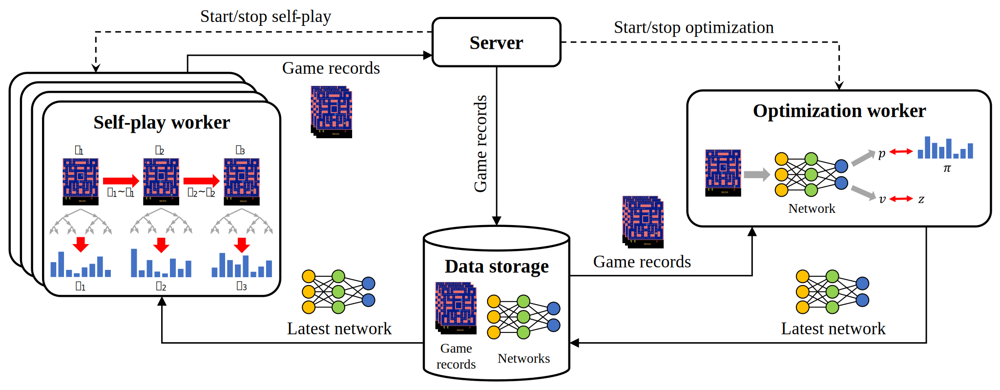

# MiniZero

MiniZero is an open-source framework for AlphaZero, MuZero, Gumbel AlphaZero, and Gumbel MuZero algorithms.

If you use MiniZero for research, please consider citing our paper as follows:
```
@misc{wu_minizero_2023,
  title={MiniZero: Comparative Analysis of AlphaZero and MuZero on Go, Othello, and Atari Games}, 
  author={Ti-Rong Wu and Hung Guei and Po-Wei Huang and Pei-Chiun Peng and Ting Han Wei and Chung-Chin Shih and Yun-Jui Tsai},
  year={2023},
  eprint={2310.11305},
  archivePrefix={arXiv},
  primaryClass={cs.AI}
}
```

Outline
* [Overview](#Overview)
    * [Architecture](#Architecture)
    * [Prerequisites](#Prerequisites)
* [Results](#Results)
* [Quick Start](#Quick-Start)
    * [Zero Training](#Zero-Training)
    * [Zero Evaluation](#Zero-Evaluation)
    * [Zero Console](#Zero-Console)
* [Development](#Development)
* [References](#References)

## Overview

MiniZero utilizes zero-knowledge learning algorithms to train game-specific AI models. 

<details open>
<summary>It includes a variety of zero-knowledge learning algorithms.</summary>

* AlphaZero
* MuZero
* Gumbel AlphaZero
* Gumbel MuZero

</details>

<details>
<summary>It features a variety of functions.</summary>

* Training high-performance game-playing AI models
* Evaluation for game-playing AI models
* GTP console for interacting with AI models
* Distributed computing

</details>

<details>
<summary>It supports a variety of game environments.</summary>

* Go
* NoGo
* Killall-Go
* Gomoku / Outer-Open Gomoku
* Othello
* Hex
* TicTacToe
* Atari (57 games)

</details>

### Architecture

The MiniZero architecture comprises four components: a *server*, *self-play workers*, an *optimization worker*, and *data storage*.



<details>
<summary>Server</summary>

The server is the core component in MiniZero, controlling the training process and managing both the self-play and optimization workers.

In each iteration, the server first instructs all self-play workers to generate self-play games simultaneously using the latest network and collects game records from self-play workers. 
Once the server accumulates the necessary self-play games, it then stops the self-play workers and instructs the optimization worker to load the latest game records and start network updates.
After the network has been updated, the server starts the next iteration until the training reaches a predetermined maximum iteration.

</details>

<details>
<summary>Self-play worker</summary>

The self-play worker interacts with the environment to produce self-play games.

There may be multiple self-play workers. Each self-play worker maintains multiple MCTS instances to play multiple games simultaneously with batch GPU inferencing to improve efficiency.
Specifically, the self-play worker runs the selection for each MCTS to collect a batch of leaf nodes and then evaluates them through batch GPU inferencing.
Finished self-play games are sent to the server and forwarded to the data storage by the server.
    
</details>

<details>
<summary>Optimization worker</summary>

The optimization worker updates the network using collected self-play games.

Specifically, it loads self-play games from data storage and stores them into the replay buffer, and then updates the network over steps using data sampled from the replay buffer.
Generally, the number of optimized steps is proportional to the number of collected self-play games to prevent overfitting.
Finally, the updated networks are stored into the data storage.

</details>

<details>
<summary>Data storage</summary>

The data storage stores network files and self-play games.

Specifically, it uses the Network File System (NFS) for sharing data across different machines.
This is an implementation choice; a simpler file system can suffice if distributed computing is not employed.

</details>

### Prerequisites

MiniZero requires a Linux platform with at least one NVIDIA GPU to operate.
To facilitate the use of MiniZero, a [container image](https://hub.docker.com/r/kds285/minizero) is pre-built to include all required packages. 
Thus, a container tool such as `docker` or `podman` is also required.

<details>
<summary>Show platform recommendations</summary>

* Modern CPU with at least 128G RAM
* NVIDIA GPU of GTX 1080 Ti (VRAM 11G) or above
* Linux operating system, e.g., Ubuntu 22.04 LTS

</details>

<details>
<summary>Show tested platforms</summary>

|CPU|RAM|GPU|OS|
|---|---|---|--|
|Xeon Silver 4216 x2|256G|RTX A5000 x4|Ubuntu 20.04.6 LTS|
|Xeon Silver 4216 x2|128G|RTX 3080 Ti x4|Ubuntu 20.04.5 LTS|
|Xeon Silver 4216 x2|256G|RTX 3090 x4|Ubuntu 20.04.5 LTS|
|Xeon Silver 4210 x2|128G|RTX 3080 x4|Ubuntu 22.04 LTS|
|Xeon E5-2678 v3 x2|192G|GTX 1080 Ti x4|Ubuntu 20.04.5 LTS|
|Xeon E5-2698 v4 x2|128G|GTX 1080 Ti x1|Arch Linux LTS (5.15.90)|
|Core i9-7980XE|128G|GTX 1080 Ti x1|Arch Linux (6.5.6)|

</details>

## Results

Through MiniZero, the performance of each zero algorithm has been systematically evaluated.
For more details, check [this paper](https://arxiv.org/abs/2310.11305).

Zero algorithms on board games (click to enlarge):
[](docs/imgs/minizero_go_9x9.svg)[](docs/imgs/minizero_othello_8x8.svg)

Zero algorithms on Atari games (click to enlarge):
[](docs/imgs/minizero_atari.svg)

Trained game-playing AI models for these games will be released soon.

## Quick Start

This section walks you through training AI models using zero algorithms, evaluating trained AI models, and launching the console to interact with the AI.

First, clone this repository.

```bash
git clone git@github.com:rlglab/minizero.git
cd minizero # enter the cloned repository
```

Then, start the runtime environment using the container. 

```bash
scripts/start-container.sh # must have either podman or docker installed
```

Once a container starts successfully, its working folder should be located at `/workspace`.


### Zero Training

Specify the target game, the zero algorithm, and the total iterations to start a training session.

```bash
tools/quick-run.sh train GAME_TYPE ALGORITHM END_ITER [OPTION]...
```

* `GAME_TYPE` sets the target game, e.g., `tictactoe`.
* `ALGORITHM` sets the zero algorithm, which should be one of `az`, `mz`, `gaz`, and `gmz`.
* `END_ITER` sets the total number of iterations for training, e.g., `100`.
* `OPTION` sets optional arguments, e.g., `-conf_str` sets additional configurations.

For detailed arguments and supported games, run `tools/quick-run.sh train -h`.

<details>
<summary>Show sample commands</summary>

```bash
# train a TicTacToe model using AlphaZero for 50 iterations
tools/quick-run.sh train tictactoe az 50

# train a 9x9 Go model using Gumbel AlphaZero with a simulation of 16 for 100 iterations
tools/quick-run.sh train go gaz 100 -conf_str env_board_size=9:actor_num_simulation=16

# train a Ms.Pac-Man model (an Atari game) using Gumbel MuZero for 200 iterations
tools/quick-run.sh train atari gmz 200 -conf_str env_atari_name=ms_pacman
```

</details><br>

The training results are stored in a folder named after the important training settings, e.g., `tictactoe_az_1bx256_n50-cb69d4`.
After the training, you can use the trained network models to run [evaluation](#Zero-Evaluation) or [console](#Zero-Console).

<details>
<summary>Shows which files are stored in the folder</summary>

* `analysis/`: the folder that contains figures of the training process.
* `model/`: the folder that stores all network models produced by each optimization step.
    * `*.pkl`: include training step, parameters, optimizer, scheduler (use for training).
    * `*.pt`: model parameters (use for testing).
* `sgf/`: the folder that stores self-play games of each iteration.
    * `1.sgf`, `2.sgf`, ... for the 1^st^, the 2^nd^, ... iteration, respectively.
* `*.cfg`: the configurations for this training session.
* `Training.log`: the main training log.
* `Worker.log`: the worker connection log.
* `op.log`: the optimization worker log.

</details><br>

Miscellaneous training tips:

<details>
<summary>Use configuration files</summary>

For a better organization of configurations, it is recommended to use config files (`.cfg`).

First, use `-gen` flag with ordinary training arguments to copy the default settings to a config file.

```bash
# save the default AlphaZero training settings for TicTacToe to "tictactoe-train.cfg"
tools/quick-run.sh train tictactoe az 50 -gen tictactoe-train.cfg

# save the modified (by -conf_str) Gumbel AlphaZero training settings for Go to "go_gaz.cfg"
tools/quick-run.sh train go gaz 100 -conf_str env_board_size=9:actor_num_simulation=16 -gen go_gaz.cfg
```

You may edit the file to tune the configurations.

Then, run the script with ordinary arguments but set the `*.cfg` at the `ALGORITHM` argument to appply it. 

```bash
# use configurations specified in "tictactoe-train.cfg" for training a TicTacToe model
tools/quick-run.sh train tictactoe tictactoe-train.cfg 20

# use configurations specified in "go_gaz.cfg" and overwrite two keys using -conf_str for training a Go model
tools/quick-run.sh train go go_gaz.cfg 100 -conf_str env_board_size=7:nn_num_blocks=2
```

</details>

<details>
<summary>Set training folder name</summary>

The folder name is automatically generated using the important training settings by default; however, it can be explicitly set by flag `-n` as follows.

```bash
# save results into folder "tictactoe_az_model"
tools/quick-run.sh train tictactoe az 50 -n tictactoe_az_model
```

Note that if the folder already exist, the program will prompt you to choose whether to retrain the model or to continue training. 
To train another model with the same settings, you should explicitly assign another folder name.

</details>

<details>
<summary>Assign another server port</summary>

The training components use TCP connections for message exchange, in which the server uses port 9999 by default.
When the port is occupied, you MUST change the server port as shown below.

```bash
# use port 11111
tools/quick-run.sh train tictactoe az 50 -conf_str zero_server_port=11111
```

</details>

<details>
<summary>Assign available GPUs for training</summary>

The program uses all available GPUs for training by default.
However, on platforms with multiple GPUs installed, you may explicitly assign available GPUs using the `-g` flag.

```bash
# use GPU 1
tools/quick-run.sh train tictactoe az 50 -g 1

# use GPUs 0, 1, 2, and 3
tools/quick-run.sh train tictactoe az 50 -g 0123
```

</details>

<details>
<summary>Continue a previous training session</summary>

Just run the script with a larger `END_ITER` and the previous training folder (by `-n`) to continue.

```bash
# continue the training of tictactoe_az_1bx256_n50-cb69d4, use AlphaZero to reach 50th iteration
tools/quick-run.sh train tictactoe az 50 -n tictactoe_az_1bx256_n50-cb69d4

# continue the training of go_9x9_gaz_1bx256_n16-cb69d4, use go_gaz.cfg with an overwritten config to reach 100th iteration
tools/quick-run.sh train go go_gaz.cfg 100 -n go_9x9_gaz_1bx256_n16-cb69d4 -conf_str actor_num_simulation=32
```

</details>

<details>
<summary>Launch training components manually</summary>

Instead of using the quick-run script, you may start the training by manually launching each training component: a zero server, several self-play workers, and an optimization worker.

#### Launch the zero server

The server manages the training session and should be launched before other components. To start a training session until a given end iteration, run
```bash!
scripts/zero-server.sh [GAME_TYPE] [CONF_FILE] [END_ITERATION] [OPTION]...
# E.g., scripts/zero-server.sh tictactoe tictactoe.cfg 100
```
* `CONF_FILE` specifies a configuration file.
* `END_ITERATION` sets the end iteration for training.
* `OPTION` are other optional arguments; run the script with `-h` for a list of supported options.
    * `-conf_str` sets configuration string for this server
    * `-n` sets the storage folder name
    * `-np` appends a prefix string to the default storage folder name
    * `-ns` appends a suffix string to the default storage folder name

> **Note**
> The server use port 9999 by default. When the port is occupied, you MUST use `-conf_str` to change the server port as shown below.
> ```bash
> scripts/zero-server.sh tictactoe tictactoe.cfg 100 -conf_str zero_server_port=11111
> ```

First, the script initialize a folder for storing training log and models. 
Based on the configuration, the folder name is automatically generated, e.g., `tictactoe_az_5bx256_n400-af37e1`.

Then, the program will print the current configuration and start printing training logs with time stamps. 
Once you have see this, it is ready to start other training components.

> **Note**
> If the script exits immediately without any warnings, it is most likely that the configuration file is incorrect. 
> Run the program directly with `-conf_file` to see what is misconfigured. E.g., `build/tictactoe/minizero_tictactoe -conf_file tictactoe.cfg`

#### Launch the zero worker

There are two types of workers, `sp` for *self-play* and `op` for *optimization*. 
To start a worker, run
```bash!
scripts/zero-worker.sh [GAME_TYPE] [SERVER] [SERVER_PORT] [sp|op] [OPTION]...
# E.g., scripts/zero-worker.sh tictactoe localhost 9999 sp
```
* `SERVER` and `SERVER_PORT` specify where to connect to the zero server.
* `sp` or `op` specifies the type of the worker.
* `OPTION` are other optional arguments; run the script with `-h` for a list of supported options.
    * `-conf_str` sets configuration string for this worker
    * `-g` sets the available GPUs for this worker (default all)
    * `-b` sets the batch size in `sp` worker (default 64)
    * `-c` sets the number of CPUs for each GPU in `sp` worker (default 4)

Both `sp` and `op` workers are required. You have to start each of them in different terminals.

For self-play, you should launch one `sp` worker instance per available GPU:
```bash!
# assume that GPU 0-3 are available, start four workers as follows.
scripts/zero-worker.sh tictactoe localhost 9999 sp -g 0
scripts/zero-worker.sh tictactoe localhost 9999 sp -g 1
scripts/zero-worker.sh tictactoe localhost 9999 sp -g 2
scripts/zero-worker.sh tictactoe localhost 9999 sp -g 3
```

For optimization, you should launch at most one `op` worker instance with all available GPUs:
```bash!
scripts/zero-worker.sh tictactoe localhost 9999 op # uses all GPUs by default
```

Note that workers can be hosted on different machines. 
Once you have successfully started a worker and connected the worker to a server, the server will print a connection message.

</details>

<details>
<summary>View board game self-play records by GoGui</summary>

[GoGui](https://github.com/Remi-Coulom/gogui) provides a graphical interface for board games.
To open the game records stored in subfolder `sgf/` by GoGui, use `tools/to-sgf.py` to convert them to general SGF formats as follows.

```bash
tools/to-sgf.py -in_file [INPUT_SGF] -out_file [OUTPUT_SGF]
```

</details>

<details>
<summary>Convert Atari game self-play records to videos</summary>

Use `tools/to-video.py` to convert Atari self-play game records from SGF to video as follows.

```bash
tools/to-video.py -in_file [INPUT_SGF] -out_dir [OUTPUT_DIR]
```

</details>


### Zero Evaluation

MiniZero currently supports two evaluation methods to evaluate program strength: [self-evaluation](#Self-Evaluation), and [fight-evaluation](#Fight-Evaluation).

#### Self-Evaluation

Self-evaluation evaluates the relative strengths between different iterations in a training session, i.e., it evaluates whether a network model is continuously improving during traing.

```bash
tools/quick-run.sh self-eval GAME_TYPE FOLDER [CONF_FILE] [INTERVAL] [GAMENUM] [OPTION]...
```

* `GAME_TYPE` sets the target game, e.g., `tictactoe`.
* `FOLDER` sets the folder to be evaluated, which should contain the `model/` subfolder.
* `CONF_FILE` sets the config file for evaluation.
* `INTERVAL` sets the iteration interval between each model pair to be evaluated, e.g. `10` indicates to pair the 0^th^ and the 10^th^ models, then the 10^th^ and 20^th^ models, and so on.
* `GAME_NUM` sets the number of games to play for each model pair, e.g., `100`.
* `OPTION` sets optional arguments, e.g., `-conf_str` sets additional configurations.

For detailed arguments, run `tools/quick-run.sh self-eval -h`.

<details>
<summary>Show sample commands</summary>

```bash
# evaluate a TicTacToe training session using "tictactoe_play.cfg", run 100 games for each model pair: 0^th^ vs 10^th^, 10^th^ vs 20^th^, ...
tools/quick-run.sh self-eval tictactoe tictactoe_az_1bx256_n50-cb69d4 tictactoe_play.cfg 10 100

# evaluate a TicTacToe training session using its training config, overwrite several settings for evaluation
tools/quick-run.sh self-eval tictactoe tictactoe_az_1bx256_n50-cb69d4 tictactoe_az_1bx256_n50-cb69d4/*.cfg 10 100 -conf_str actor_select_action_by_count=true:actor_use_dirichlet_noise=false:actor_num_simulation=200

# use more threads for faster evaluation
tools/quick-run.sh self-eval tictactoe tictactoe_az_1bx256_n50-cb69d4 tictactoe_play.cfg 10 100 --num_threads 20
```

</details><br>

The evaluation results are stored inside `FOLDER`, in a subfolder named `self_eval` by default, in which records of each model pair are named by the step index of model files, e.g., `5000_vs_0`, `10000_vs_5000`, and so on.

Miscellaneous evaluation tips:

<details>
<summary>Set configurations for evaluation</summary>

For evaluation, use more simulations and disable noise to always select the best action.
```
actor_num_simulation=400
actor_select_action_by_count=true
actor_select_action_by_softmax_count=false
actor_use_dirichlet_noise=false
actor_use_gumbel_noise=false
```

In addition, sometimes played games become too similar. To prevent this, use random rotation (for AlphaZero only) or even add softmax/noise back.
```
actor_use_random_rotation_features=true
actor_select_action_by_count=false
actor_select_action_by_softmax_count=true
```

Note that evaluation is generally unnecessary for Atari games.

</details>

<details>
<summary>Analyze and visualize evaluation results</summary>

A script is provided to analyze and visualize evaluation results.
```bash
tools/eval.py -in_dir [EVAL_FOLDER] --plot

# E.g., tools/eval.py -in_dir tictactoe_az_1bx256_n50-cb69d4/self_eval --plot
```

The analysis is saved as `[EVAL_FOLDER]/elo.csv` and `[EVAL_FOLDER]/elo.png`.

</details>

#### Fight-Evaluation

Fight-evaluation evaluates the relative strengths between the same iterations of two training sessions, i.e., it compares the learning results of two network models.

```bash
tools/quick-run.sh fight-eval GAME_TYPE FOLDER1 FOLDER2 [CONF_FILE1] [CONF_FILE2] [INTERVAL] [GAMENUM] [OPTION]...
```

* `GAME_TYPE` sets the target game, e.g., `tictactoe`.
* `FOLDER1` and `FOLDER2` set the two folders to be evaluated.
* `CONF_FILE1` and `CONF_FILE2` set the config files for both folders; if `CONF_FILE2` is unspecified, `FOLDER2` will uses `CONF_FILE1` for evaluation.
* `INTERVAL` sets the iteration interval between each model pair to be evaluated, e.g. `10` indicates to match the i^th^ models of both folders, then the i+10^th^ models, and so on.
* `GAME_NUM` sets the number of games to play for each model pair, e.g., `100`.
* `OPTION` sets optional arguments, e.g., `-conf_str` sets additional configurations.

For detailed arguments, run `tools/quick-run.sh fight-eval -h`.

<details>
<summary>Show sample commands</summary>

```bash
# evaluate two training results using "tictactoe_play.cfg" for both programs, run 100 games for each model pair
tools/quick-run.sh self-eval tictactoe tictactoe_az_1bx256_n50-cb69d4 tictactoe_az_1bx256_n50-731a0f tictactoe_play.cfg 10 100

# evaluate two training results using "tictactoe_cb69d4.cfg" and "tictactoe_731a0f.cfg" for the former and the latter, respectively
tools/quick-run.sh self-eval tictactoe tictactoe_az_1bx256_n50-cb69d4 tictactoe_az_1bx256_n50-731a0f tictactoe_cb69d4.cfg tictactoe_731a0f.cfg 10 100
```

The evaluation results are stored inside `FOLDER1`, in a subfolder named `[FOLDER1]_vs_[FOLDER2]_eval` by default, in which records of each model pair are named by the step index of model files, e.g., `0`, `5000`, and so on.

</details><br>

The evaluation tips for [Self-Evaluation](#Self-Evaluation) also apply here.

### Zero Console

MiniZero supports the [Go Text Protocol (GTP)](http://www.lysator.liu.se/~gunnar/gtp/) and has a built-in console for easy communication with human operators or external programs.

```bash
tools/quick-run.sh console GAME_TYPE FOLDER|MODEL_FILE [CONF_FILE] [OPTION]...
```

* `GAME_TYPE` sets the target game, e.g., `tictactoe`.
* `FOLDER` or `MODEL_FILE` sets either the folder or the model file (`*.pt`).
* `CONF_FILE` sets the config file for console.
* `OPTION` sets optional arguments, e.g., `-conf_str` sets additional configurations.

For detailed arguments, run `tools/quick-run.sh console -h`.

<details open>
<summary>Show sample commands</summary>

```bash
# run a console with the latest model inside "tictactoe_az_1bx256_n50-cb69d4" using config "tictactoe_play.cfg"
tools/quick-run.sh console tictactoe tictactoe_az_1bx256_n50-cb69d4 tictactoe_play.cfg

# run a console with a specified model file using config "tictactoe_play.cfg"
tools/quick-run.sh console tictactoe tictactoe_az_1bx256_n50-cb69d4/model/weight_iter_25000.pt tictactoe_play.cfg

# run a console with the latest model inside "tictactoe_az_1bx256_n50-cb69d4" using its default config file, and overwrite several settings for console
tools/quick-run.sh console tictactoe tictactoe_az_1bx256_n50-cb69d4 -conf_str actor_select_action_by_count=true:actor_use_dirichlet_noise=false:actor_num_simulation=200
```

</details><br>

Note that the console requires a trained network model.

After the console starts successfully, a message "Successfully started console mode" will be displayed.
Then, use [GTP commands](https://www.gnu.org/software/gnugo/gnugo_19.html) to interact with the program, e.g., `genmove`.

Miscellaneous console tips:

<details>
<summary>Attach MiniZero to GoGui</summary>

[GoGui](https://github.com/Remi-Coulom/gogui) provides a graphical interface for board game AI programs, it provides two tools, `gogui-server` and `gogui-client`, to attach programs that support GTP console.

To attach MiniZero to GoGui, specify the `gogui-server` port via `-p`, which will automatically starts the MiniZero console with the `gogui-server`.

</details>

## Development

For execution efficiency, the core components (e.g., MCTS) are written in C++, while NN-related components are written in Python using the PyTorch library. To integrate C++ with Python, Pybind is adopted.

We are actively adding new algorithms, features, and games into MiniZero, and the following pending features will be available in future versions.

<details>
<summary>Show work-in-progress features</summary>

* Stochastic MuZero
* Sampled MuZero

</details><br>

We welcome developers to join the MiniZero community. 
Here are development tips.

<details>
<summary>Build program</summary>

The `tools/quick-run.sh` script used in the [Quick Start](#Quick-Start) always automatically builds program when necessary.
However, to build program on demand, use `scripts/build.sh` as follows.

```bash!
scripts/build.sh [GAME_TYPE] [BUILD_TYPE]
# E.g., scripts/build.sh tictactoe release
```
* `GAME_TYPE`:  the target game, e.g., `atari`,`go`,`gomoku`,`othello`,`tictactoe`.
    * Running different games requires different builds with corresponding `GAME_TYPE`.
    * For the full list of supported games, run `scripts/build.sh -h`
    * If `GAME_TYPE` is not specified, the script will rebuild all existing builds.
* `BUILD_TYPE`: `release` (default) or `debug`.
    * To change a `release` build to a `debug` build, you have to manually remove `build/[GAME_TYPE]` folder and restart the build script; and vice versa.

The script runs `cmake` for setup and runs `make` for build.
After build, the executable is generated at `build/[GAME_TYPE]/minizero_[GAME_TYPE]`, e.g., `build/tictactoe/minizero_tictactoe`.

For modifying existing source files, simply run the build script again for an increasemental build.
However, for adding new source files, the `build/[GAME_TYPE]` folder must be removed before running the build script to let `cmake` be triggered again.

</details>

<details>
<summary>Run program</summary>

#### Program mode

The MiniZero program defines *modes* for different scenarios, specified by `-mode [MODE]`, e.g.,

```bash
build/[GAME_TYPE]/minizero_[GAME_TYPE] [OPTION]...
# E.g., ./build/tictactoe/minizero_tictactoe -mode env_test
# E.g., ./build/tictactoe/minizero_tictactoe -mode consle
```

For the full list of supported modes, run the program with `-h`.
When using the program for standard scenarios such as training or testing, you **DO NOT** need to run the program directly. 
Instead, scripts are provided. See the related sections for more details.

Program configuration

The program configuration can be set using a *configuration file* or a *configuration string*, e.g.,
```bash
build/[GAME_TYPE]/minizero_[GAME_TYPE] [OPTION]...
# E.g., build/tictactoe/minizero_tictactoe -gen tictactoe.cfg
# E.g., build/tictactoe/minizero_tictactoe -conf_file tictactoe.cfg # run default console mode
# E.g., build/tictactoe/minizero_tictactoe -conf_file tictactoe.cfg -conf_str actor_num_simulation=100
```
* `-gen [CONF_FILE]`: generate a clean configuration file (`*.cfg`)
* `-conf_file [CONF_FILE]`: specify a configuration file (`*.cfg`)
    * A configuration file is a collection of `key=value` settings.
    * If no configuration is specified, the program will run with the built-in default. 
* `-conf_str [CONF_STR]`: set configuration via command line
    * The `CONF_STR` may contain multiple `key=value` pairs, seperated by the colon character.
    * The settings set by `-conf_str` are adopted with the highest priority.

> **Note**
> The arguments `-conf_file` and `-conf_str` can be set at the same time. For example,
> ```bash
> build/go/minizero_go -mode console -conf_file go.cfg -conf_str "nn_file_name=go_az/model/weight_iter_10000.pt:actor_num_simulation=100"
> ```
> In the example, the program is started using `console` mode.
> The two `-conf_str` settings, `nn_file_name` and `actor_num_simulation`, overwrite the same keys in the `go.cfg` (if present). Note that for settings neither specified by `-conf_str` nor in `go.cfg`, the built-in defaults are applied.

</details><br>

More development tips will be released soon.

## References
- [MiniZero: Comparative Analysis of AlphaZero and MuZero on Go, Othello, and Atari Games](https://arxiv.org/abs/2310.11305)
- [Mastering the game of Go without human knowledge (AlphaGo Zero)](https://doi.org/10.1038/nature24270)
- [A general reinforcement learning algorithm that masters chess, shogi, and Go through self-play (AlphaZero)](https://doi.org/10.1126/science.aar6404)
- [Mastering Atari, Go, chess and shogi by planning with a learned model (MuZero)](https://doi.org/10.1038/s41586-020-03051-4)
- [Policy improvement by planning with Gumbel (Gumbel MuZero)](https://openreview.net/forum?id=bERaNdoegnO)
